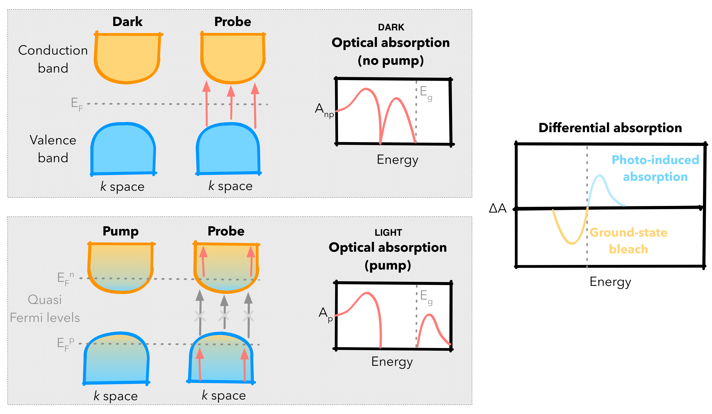

[](https://pytaser.readthedocs.io/en/latest/?badge=latest)
[](https://www.python.org/)
[](https://opensource.org/licenses/MIT)
[](https://github.com/WMD-Group/PyTASER/actions)
[](https://pypi.org/project/pytaser)
[](https://img.shields.io/badge/code%20style-black-000000.svg)

# PyTASER

[](https://pytaser.readthedocs.io/en/latest/)

[Official Documentation](https://pytaser.readthedocs.io/en/latest/)

``PyTASER`` is a ``Python`` library for simulating differential absorption spectra in compounds using
quantum chemical calculations, including transient (TAS) and differential (DAS) absorption spectroscopies.
The goal of this library is to simulate spectra for comparison with and interpretation of experiments. The main features include:

* Transient (TAS) and differential (DAS) absorption spectra for insulating and semiconducting crystals
  (using pre-calculated DFT, or database calculations)
* Spectra for different temperature and carrier density conditions
* Separation of spectral contributions from individual band-to-band transitions
* Integration with the Materials Project database, allowing support for non-locally calculated materials
* Ability to produce publication-ready figures, with flexibility in plotting.


PyTASER is designed for users with moderate experience in computational methods and optical techniques, enabled by the following features:

* Use of Python as the programming language (due to its low entry barrier, flexibility and popularity in the materials modelling field)
* Documentation and easy-to-follow workflows with complete unit-test coverage.
* Interfaced with the popular materials analysis package [`pymatgen`](https://pymatgen.org/index.html).
* Currently compatible with VASP, while support for other electronic structure codes is planned – if you have a specific request, please open an issue!

# Background

TAS is a powerful pump-probe tool to characterise the excited states of materials, while DAS can be used to represent how changes in a system affects its ground-state optical absorption spectra. These techniques can be used to understand microscopic processes in photochemical and electrochemical transformations, including phenomena such as electron trapping and carrier recombination.

The drawback is that TAS spectra are difficult to interpret, especially for crystals where the specific valence and conduction band structure can give rise to complex features. Our goal here is to predict TAS features from first-principles starting from the most simple models of static excitations through to the kinetics of relaxation of the excited state back to the ground state.

To achieve this, PyTASER identifies the allowed vertical optical transitions between electronic bands of the material to determine possible excitations that can occur from the ground 'dark' and excited 'light' electronic states.
This is done by calculating the effective absorption in each state - this is a product of the joint density of states (JDOS) and the transition probability for each band transition, both of which are based on post-processing ground state DFT calculations. Once calculated, PyTASER compares changes in electronic transitions between the dark and light states, as demonstrated in the figure below.

<p align="center">
  
</p>
<p align="center">
  <em>Schematics of the ground and excited state electronic structures and optical profiles. The ground 'dark' state is at the top, showing full occupancy and unoccupancy (blue, orange) for the conduction and valence bands respectively. The excited 'light' state shows partial occupancy in a similar plot at the bottom. The overall DA plot is displayed to the right, the difference between the dark and light effective absorption plots.</em>
</p>

## JDOS method

# Installation

To install the module with `pip` (recommended): 

```
pip install pytaser
```
To install directly from the git repository:
```
pip install git+https://github.com/WMD-group/PyTASER
```
Alternatively `python setup.py install` can also be used.

PyTASER is compatible with Python 3.9+ and relies on a number of open-source packages, specifically:

* [pymatgen](https://pymatgen.org/index.html) 
* [numpy](https://numpy.org/), [scipy](https://scipy.org/) for data structures and unit conversion
* [matplotlib](https://matplotlib.org/) for plotting the spectra

# Developer’s installation (optional)

For development work, PyTASER can also be installed from a copy of the source directory:

Download PyTASER source code using the command:
```
git clone https://github.com/WMD-group/PyTASER
```
Navigate to root directory:
```
cd PyTASER
```
Install the code with the command:
```
pip install -e .
```
This command tries to obtain the required packages and their dependencies and install them automatically.

# Visualisation 

The recommended approach is to use ``PyTASER`` within an interactive python environment (such as a Jupyter Notebook), as shown in the [tutorials](https://pytaser.readthedocs.io/en/latest/dft_examples.html) on the docs and the [examples](https://github.com/WMD-group/PyTASER/blob/main/examples) folder.
Alternatively, you can use ``PyTASER`` through python scripts (e.g. with `python <filename.py>`).

If using your own, locally calculated data, please follow [this](https://github.com/WMD-group/PyTASER/blob/main/examples/PyTASER_DFT_Example.ipynb) workflow.
Otherwise, use the MP-integrated workflow [here](https://github.com/WMD-group/PyTASER/blob/main/examples/PyTASER_MP_Example.ipynb). 

# Contributing

We appreciate any contributions in the form of a pull request. Please see the [Contributing](https://pytaser.readthedocs.io/en/latest/contributing.html) documentation for more details.
Additional analysis/example spectra performed with `PyTASER` would be welcomed.

Please feel free to reach out to us via the [Issue Tracker](https://github.com/WMD-group/PyTASER/issues) if there are any questions or suggestions. 

# Testing

Unit tests are in the `tests` directory and can be run from the top directory using [pytest](https://pytest.org). Automatic testing is run on the master and develop branches using Github Actions. 

Please run tests and add new tests for any new features whenever submitting pull requests.

# Future Work

Future topics we plan to build on:

* Incorporating finite-temperature effects (particularly for indirect band-to-band transitions)
* Direct treatment of pump-probe time delay and relaxation kinetics 
* Incorporating spin-flip processes for spin-polarised systems
* Description of defective crystals 

# Acknowledgements

The project has been developed by @savya10, @kavanase, @LucasGVerga and @youngwonwoo, under the supervision of @utf and @aronwalsh.
